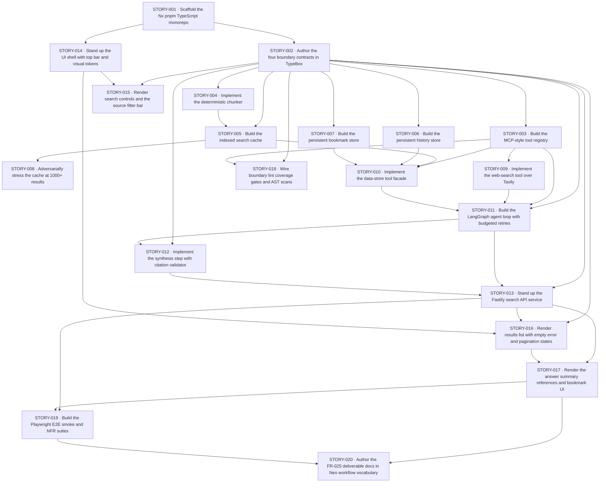

<!-- regenerated on every run by story_planner. Do not edit by hand. -->

# Dependency DAG — project-spec

## Graph

## Edges
| From | To | Reason |
| --- | --- | --- |
| STORY-001 | STORY-002 | STORY-002 needs the workspace + the `@neo-search/contracts` package skeleton. |
| STORY-001 | STORY-014 | STORY-014 needs `apps/ui` to exist before wiring Vite + Tailwind into it. |
| STORY-002 | STORY-003 | STORY-003 imports `ToolDescriptorContract`, `ToolErrorContract`, `Result<T,E>` from `@neo-search/contracts`. |
| STORY-002 | STORY-004 | STORY-004 imports `ResultCardContract` to type chunk inputs. |
| STORY-002 | STORY-005 | STORY-005 imports `ResultCardContract`, `PaginationContract`. |
| STORY-002 | STORY-006 | STORY-006 imports `HistoryEntryContract`, `PaginationContract`. |
| STORY-002 | STORY-007 | STORY-007 imports `BookmarkEntryContract`, `BookmarkSaveContract`, `PaginationContract`. |
| STORY-002 | STORY-011 | STORY-011 imports `AgentSearchRequestContract`, `AgentSearchResponseContract`, `Result<T,E>`. |
| STORY-002 | STORY-012 | STORY-012 imports `SynthesisInputContract`, `SynthesisOutputContract`, `ReferenceEntryContract`. |
| STORY-002 | STORY-013 | STORY-013 imports the wire contracts for Fastify schema validation. |
| STORY-002 | STORY-015 | STORY-015 imports `SourceFilterEnum`, `SearchRequestContract`. |
| STORY-002 | STORY-016 | STORY-016 imports `UiApiAnswerContract`, `ResultCardContract`, `PaginationContract`. |
| STORY-002 | STORY-018 | STORY-018's contract-test gate needs the contracts to exist. |
| STORY-003 | STORY-009 | STORY-009 registers `web-search` via `defineTool` from the registry package. |
| STORY-003 | STORY-010 | STORY-010 registers `data-store` via `defineTool`. |
| STORY-003 | STORY-011 | STORY-011's agent calls `registry.invoke` through the registry interface. |
| STORY-003 | STORY-018 | STORY-018 re-asserts the registry's `exports` field discipline via lint. |
| STORY-004 | STORY-005 | STORY-005 calls the chunker on every cache write. |
| STORY-005 | STORY-008 | STORY-008 stresses the cache at 1000 / 5000 / 10000 results. |
| STORY-005 | STORY-010 | STORY-010's `cache.write` / `cache.read` ops delegate to `SearchCache`. |
| STORY-006 | STORY-010 | STORY-010's `history.append` / `history.list` ops delegate to `HistoryStore`. |
| STORY-007 | STORY-010 | STORY-010's `bookmark.save` / `bookmark.list` / `bookmark.get` ops delegate to `BookmarkStore`. |
| STORY-009 | STORY-011 | STORY-011 invokes `web-search` through the registry; needs the tool registered. |
| STORY-010 | STORY-011 | STORY-011 invokes `data-store` through the registry; needs the tool registered. |
| STORY-011 | STORY-012 | STORY-012 swaps the agent's test fake `synthesize` for the real implementation. |
| STORY-011 | STORY-013 | STORY-013 imports the agent factory and binds it behind Fastify routes. |
| STORY-012 | STORY-013 | STORY-013's composition root constructs the real synthesizer for the agent. |
| STORY-013 | STORY-016 | STORY-016's UI calls `POST /api/search` and renders the response. |
| STORY-013 | STORY-017 | STORY-017's bookmark UI calls `POST /api/bookmarks`. |
| STORY-013 | STORY-019 | STORY-019's e2e harness boots the API to drive the live system. |
| STORY-014 | STORY-015 | STORY-015 drops controls into the shell's slot and consumes the Tailwind tokens. |
| STORY-014 | STORY-016 | STORY-016 drops the results area into the shell's slot. |
| STORY-016 | STORY-017 | STORY-017 composes `AnswerSummary` + `ReferencesList` above the existing results list. |
| STORY-017 | STORY-019 | STORY-019's smoke spec asserts answer + references render end-to-end. |
| STORY-017 | STORY-020 | STORY-020's deliverable docs describe the now-rendering answer + references. |
| STORY-019 | STORY-020 | STORY-020 references the `pnpm e2e:smoke` gate as the FR-025 (a) "runnable prototype" evidence. |

## Waves

A **wave** is a set of stories with no dependencies between them. Stories in the same wave MAY be picked up in parallel — one `developer` agent per story, each on its own worktree. Wave N+1 cannot start until every story in wave N is `done`.

Waves are derived by Kahn's algorithm: wave 1 = all stories with no incoming edges; wave N = all stories whose dependencies are all in waves < N. Cross-initiative dependencies (`external_depends_on`) do NOT participate in wave assignment but are listed below as preconditions on the entire initiative.

### Wave 1 (no prerequisites · 1 story)
- STORY-001 — Scaffold the Nx pnpm TypeScript monorepo (points: 5, requirements: FR-024, FR-025)

### Wave 2 (after wave 1 · 2 stories · MAY run in parallel)
- STORY-002 — Author the four boundary contracts in TypeBox (points: 5, requirements: FR-010, FR-021)
- STORY-014 — Stand up the UI shell with top bar and visual tokens (points: 5, requirements: FR-001, NFR-001, NFR-002)

### Wave 3 (after wave 2 · 5 stories · MAY run in parallel)
- STORY-003 — Build the MCP-style tool registry (points: 3, requirements: FR-021, FR-022, FR-023)
- STORY-004 — Implement the deterministic chunker (points: 3, requirements: FR-017, FR-019)
- STORY-006 — Build the persistent history store (points: 3, requirements: FR-014)
- STORY-007 — Build the persistent bookmark store (points: 3, requirements: FR-015)
- STORY-015 — Render search controls and the source filter bar (points: 3, requirements: FR-002, FR-003)

### Wave 4 (after wave 3 · 3 stories · MAY run in parallel)
- STORY-005 — Build the indexed search cache with SQLite plus segmented JSON (points: 5, requirements: FR-016, FR-018, FR-020, NFR-004)
- STORY-009 — Implement the web-search tool over Tavily (points: 5, requirements: FR-012, FR-022, FR-023, NFR-005)
- STORY-018 — Wire boundary lint coverage gates and AST scans (points: 3, requirements: FR-021, FR-024, NFR-006)

### Wave 5 (after wave 4 · 2 stories · MAY run in parallel)
- STORY-008 — Adversarially stress the cache at 1000+ results (points: 3, requirements: NFR-003)
- STORY-010 — Implement the data-store tool facade (points: 3, requirements: FR-022, FR-023, FR-014, FR-015, FR-016, FR-018, NFR-006)

### Wave 6 (after wave 5 · 1 story)
- STORY-011 — Build the LangGraph agent loop with budgeted retries (points: 5, requirements: FR-011, FR-021, FR-022, FR-023, FR-024, NFR-005, NFR-006)

### Wave 7 (after wave 6 · 1 story)
- STORY-012 — Implement the synthesis step with citation validator (points: 5, requirements: FR-007, FR-008, FR-009, FR-013)

### Wave 8 (after wave 7 · 1 story)
- STORY-013 — Stand up the Fastify search API service (points: 5, requirements: FR-005, FR-010, FR-021, FR-023, FR-024)

### Wave 9 (after wave 8 · 1 story)
- STORY-016 — Render results list with empty error and pagination states (points: 5, requirements: FR-004, FR-005, FR-006)

### Wave 10 (after wave 9 · 1 story)
- STORY-017 — Render the answer summary references and bookmark UI (points: 3, requirements: FR-007, FR-008, FR-009, FR-015)

### Wave 11 (after wave 10 · 1 story)
- STORY-019 — Build the Playwright E2E smoke and NFR suites (points: 5, requirements: FR-001, FR-002, FR-003, FR-004, FR-005, FR-006, FR-012, FR-025, NFR-001, NFR-002, NFR-005)

### Wave 12 (after wave 11 · 1 story)
- STORY-020 — Author the FR-025 deliverable docs in Neo workflow vocabulary (points: 3, requirements: FR-025)

## Critical path
Longest chain (sequential lower bound on time-to-done): `STORY-001 → STORY-002 → STORY-004 → STORY-005 → STORY-010 → STORY-011 → STORY-012 → STORY-013 → STORY-016 → STORY-017 → STORY-019 → STORY-020` (12 stories, total points: 52).

## External prerequisites
Stories that depend on work outside this initiative or on operator-supplied secrets:
- STORY-009 → external: requires `TAVILY_API_KEY` env var available in dev and CI before the integration tests can hit the recorded fixture and the smoke job can hit the live API.
- STORY-012 → external: requires `ANTHROPIC_API_KEY` env var available in dev and CI before the synthesis tests can run against the fake client (the key gate falls in the smoke job; unit tests use a fake `anthropic` client and do not need the key).
- STORY-019 → external: requires both `TAVILY_API_KEY` and `ANTHROPIC_API_KEY` env vars to be set in the smoke-job environment (the smoke project is gated on key presence and is skipped, not failed, when missing).

## Validation
- Acyclic: verified (no cycle detected — every `depends_on` references a strictly lower-numbered STORY ID).
- Coverage: every story listed in this folder appears in exactly one wave.
- Wave count: 12. Critical path length (stories): 12. Critical path points: 52.
